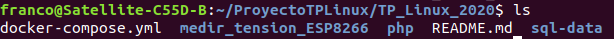
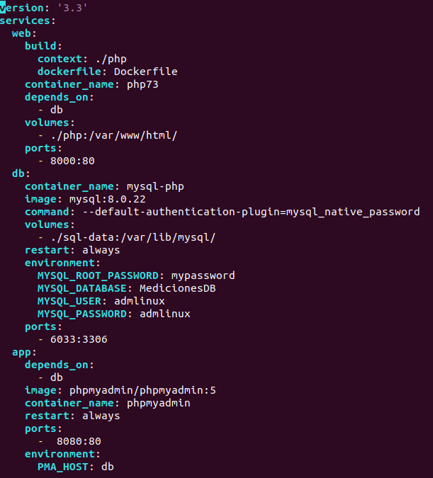
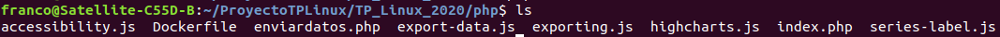
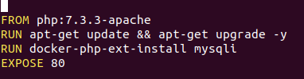
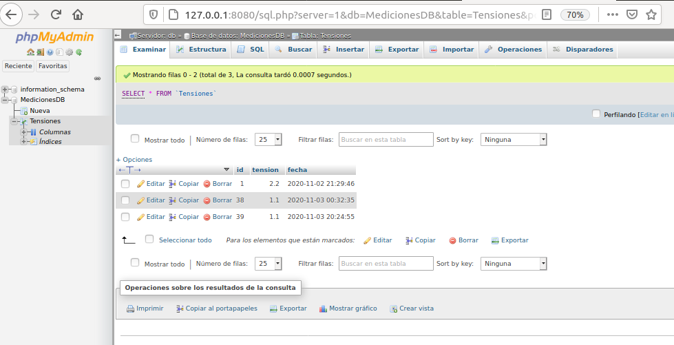
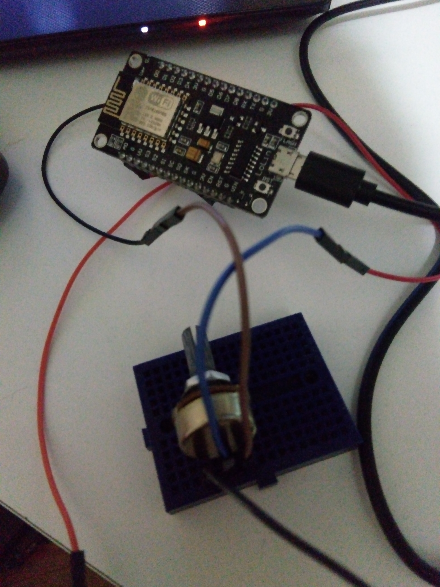
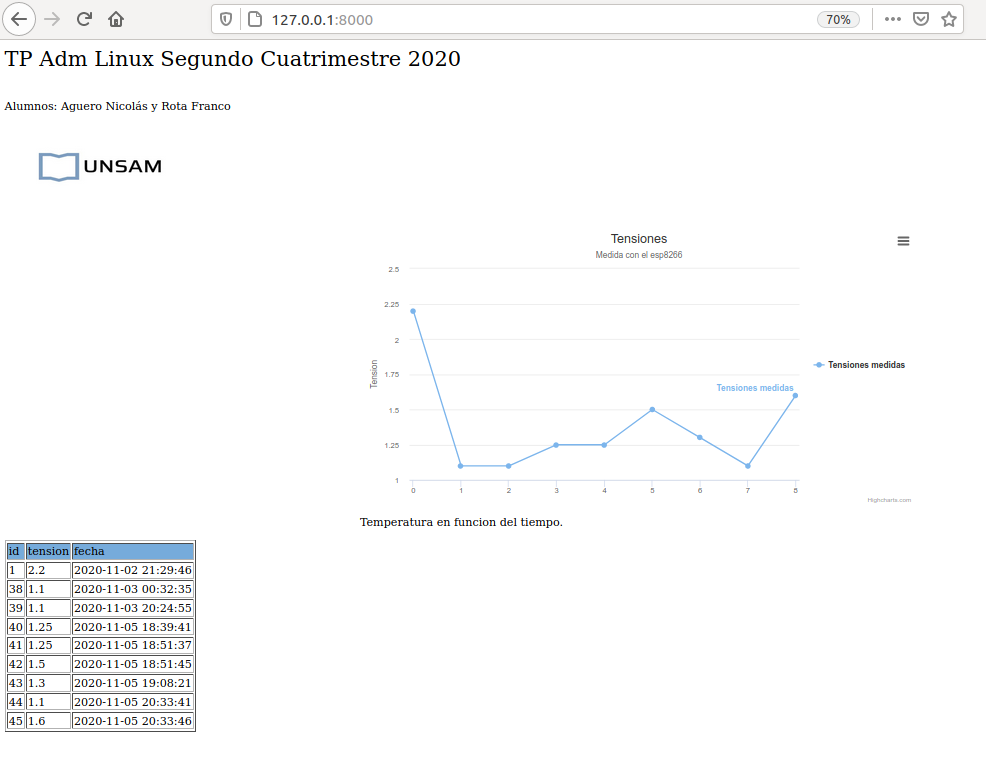

# TP_Linux_2020

# Creacion de Base de Datos con MySQL desde Docker: Aplicación IoT 

Mediante Docker integramos una base de datos con consultas que se puedan hacer con PHPMyAdmin. Finalmente con una página local creada con PHP mostramos los datos tomados y enviados por un ESP8266.

## 1. Descripción de Carpetas y Archivos del proyecto:

El proyecto consta de 3 carpetas principales y 1 archivo.

Carpetas:

- medir_tension_ESP8266: Con el código de Arduino para sensar voltaje y enviarlo a la red WiFi.
- php: Con los archivos necesarios para tomar los datos enviados por WiFi e integrarlos a la Base de Datos (BD).
- sql-data: Carpeta donde se guarda la información de la BD permanentemente.

Archivo:
- docker-compose.yml: Que integra los archivos contenidos en las carpetas anteriormente mensionadas y desde donde arranca el sistema.

### 1.1 Docker Compose:

Va a integrar 3 servicios.El servicio `web` , `db` y `app` que detallamos a continuación:

#### web

Servicio que se contruye (_build_) mediante el contexto que obtiene de la carpeta *php*.
Desde esa carpeta va a levantar la imagen personalizada de  PHP con Apache configurado en su Dockerfile correspondiente.

El nombre del contenedor para este servicio se le designó como *php73*

Mediante la instrucción `depends_on` especificamos que escriba y/o lea en la base de datos mediante el servicio `db` que a continuación explicaremos.

Creamos un `volumen` para enlazar el contenedor con una carpeta (_en este caso es_ *./php* ) y vamos a hacer que la carpeta */var/www/html* apunte a ./php.
Es decir que el servidor Apache instalado se "alimenta" de la carpeta local ./php y los cambios que hagamos dentro de esta última se van a ver reflejados inmediatamente en la página mediante el uso del contenedor.

El servidor Apache expone el puerto *80* y especificamos que el puerto para utilizar este servicio va a ser el `8000` 

La imagen de PHP que descargaremos desde dockerhub es la 7.3-apache.

#### Carpeta php
La carpeta se compone de un `Dockerfile` donde personalizamos nuestra imagen de php, un archivo `index.php` donde se encuentra el código php para mostrar el grafico, mediciones e imagen en el navegador y archivos `javascript` que crean el gráfico.

##### Dockerfile
El Dockerfile dentro de la carpeta php nos personaliza la imagen descargada desde dockerhub haciéndole las actualizaciones y mejores necesarias cada vez que se ejecute el script, instala una extensión que nos permita usar funciones que comuniquen php y MySQL llamada `mysqli` y finalmente expone el puerto 80.

#### db

Este es el servicio que va a manejar la Base de Datos.
Le damos el nombre *mysql-php* al contenedor y que utilize la imagen que obtenga de dockerhub (_nuestro caso mysql version 8.0.22_).

Queremos crear un usuario personalizado en esta BD. De manera que pasamos el comando `--default-authentication-plugin=mysql_native_password` es una manera de autenticarse por defecto, es posible que para versiones recientes de MySQL no sea necesaria.

Vamos a crear un *volumen* donde la base de datos haga persistente los datos que guarda y los mantenga aunque demos de baja el servicio.
En la carpeta local `./sql-data` va a guardar las modificaciones que redireccione desde `/var/lib/mysql`

Le decimos que reinicie el servicio si alguna configuracion cambia con `restart:always`

Ahora creamos un *environment* (ambiente) donde especificaremos los usuarios y sus contraseñas:
Con el parámetro `MYSQL_ROOT_PASSWORD` especificamos una clave para el usuario root que use la BD.
Con `MYSQL_DATABASE` creamos una BD por defecto que se mantendrá persistente.
Luego creamos el usuario personalizado `admlinux` mediante el parámetro `MYSQL_USER` y una clave para el mismo con `MYSQL_PASSWORD`.

Por último, MySQL va a exponer el puerto `3306` que será redireccionado a nuestro puerto local `6033`.

#### app

Con el servicio `app` levantamos una imagen de `phpmyadmin` para visualizar los registros de datos al ir al puerto `8080` en nuestro navegador (siempre de manera local)
El parámetro *depends_on* nos lo enlaza a nuestro servicio *db* para leer y escribir en la BD.
Usamos la imagen de `phpmyadmin:5` que obtenemos de dockerhub.

Especificamos el environment.Con `PMA_HOST` definimos el nombre de la direccion/anfitrion del servidor de MYSQL (usamos el servicio *db*)

#### Archivo enviardatos.php

Dentro de la carpeta php tenemos el index que tiene código php y nos va mostrando distintas cosas en nuestro navegador.

### PHPMyAdmin

Desde PHPMyAdmin podemos ver y editar los registros de nuestra base de datos (borrar,agregar,modificar filas)
Es una interfaz mucho más amigable para el usuario que ingresando por MySQL de la forma convencional (ejecutando el servicio desde consola)
Podemos acceder a este servicio escribiendo en la url de nuestro navegador: `localhost:8080` 

### Node MCU ESP8266
Es un dispositivo para crear aplicaciones que usen WiFi.
Se conectar por USB a nuestra PC y entrega una salida de tensión de 3.3V, la cual conectamos con un potenciómetro y variamos la tensión que se enviará por WiFi a nuestra aplicación con Docker.

### Grafico y Tabla
Los valores de tensión enviados por el ESP8266 se muestran en un gráfico al ingresar en la url de nuestro navegador la ip de nuestra máquina y el puerto 8000 `localhost:8000`

El gráfico esta creado con una serie de scripts .js ya prearmados y sólo le enviamos los registros que queremos que lea de la BD

Adicionalmente en el archivo index.php leemos una imagen en una carpeta local que nos muestre el logo de la Universidad y debajo del gráfico que vaya mostrando los registros que cambian en la BD.

 
